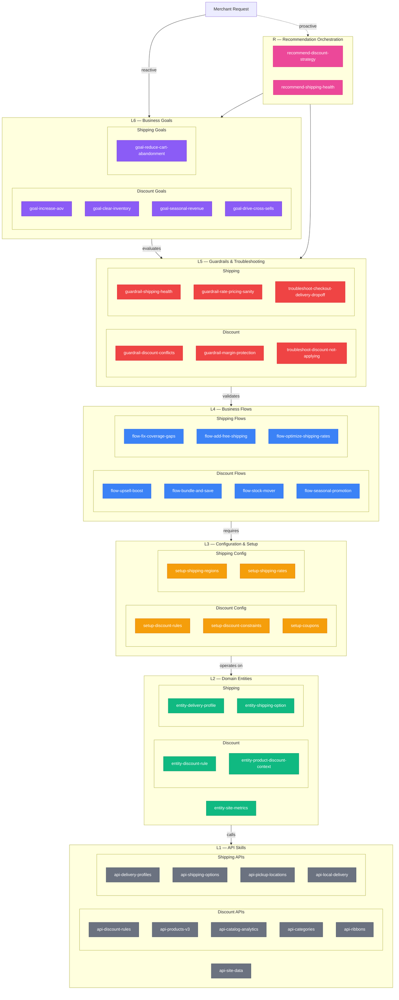

## Skill Graph Diagram

```mermaid
flowchart TB
    MR["Merchant Request"] --> |reactive| L6
    MR -.-> |proactive| R

    subgraph R["R — Recommendation Orchestration"]
        recommend-discount-strategy
        recommend-shipping-health
    end

    R --> L6
    R --> L5

    subgraph L6["L6 — Business Goals"]
        subgraph L6D["Discount Goals"]
            goal-increase-aov
            goal-clear-inventory
            goal-seasonal-revenue
            goal-drive-cross-sells
        end
        subgraph L6S["Shipping Goals"]
            goal-reduce-cart-abandonment
        end
    end

    L6 --> |evaluates| L5

    subgraph L5["L5 — Guardrails & Troubleshooting"]
        subgraph L5D["Discount"]
            guardrail-discount-conflicts
            guardrail-margin-protection
            troubleshoot-discount-not-applying
        end
        subgraph L5S["Shipping"]
            guardrail-shipping-health
            guardrail-rate-pricing-sanity
            troubleshoot-checkout-delivery-dropoff
        end
    end

    L5 --> |validates| L4

    subgraph L4["L4 — Business Flows"]
        subgraph L4D["Discount Flows"]
            flow-upsell-boost
            flow-bundle-and-save
            flow-stock-mover
            flow-seasonal-promotion
        end
        subgraph L4S["Shipping Flows"]
            flow-fix-coverage-gaps
            flow-add-free-shipping
            flow-optimize-shipping-rates
        end
    end

    L4 --> |requires| L3

    subgraph L3["L3 — Configuration & Setup"]
        subgraph L3D["Discount Config"]
            setup-discount-rules
            setup-discount-constraints
            setup-coupons
        end
        subgraph L3S["Shipping Config"]
            setup-shipping-regions
            setup-shipping-rates
        end
    end

    L3 --> |operates on| L2

    subgraph L2["L2 — Domain Entities"]
        subgraph L2D["Discount"]
            entity-discount-rule
            entity-product-discount-context
        end
        subgraph L2S["Shipping"]
            entity-delivery-profile
            entity-shipping-option
        end
        entity-site-metrics
    end

    L2 --> |calls| L1

    subgraph L1["L1 — API Skills"]
        subgraph L1D["Discount APIs"]
            api-discount-rules
            api-products-v3
            api-catalog-analytics
            api-categories
            api-ribbons
        end
        subgraph L1S["Shipping APIs"]
            api-delivery-profiles
            api-shipping-options
            api-pickup-locations
            api-local-delivery
        end
        api-site-data
    end

    classDef l6 fill:#8b5cf6,stroke:#6d28d9,color:#fff
    classDef l5 fill:#ef4444,stroke:#dc2626,color:#fff
    classDef l4 fill:#3b82f6,stroke:#2563eb,color:#fff
    classDef l3 fill:#f59e0b,stroke:#d97706,color:#fff
    classDef l2 fill:#10b981,stroke:#059669,color:#fff
    classDef l1 fill:#6b7280,stroke:#4b5563,color:#fff
    classDef reco fill:#ec4899,stroke:#db2777,color:#fff

    class goal-increase-aov,goal-clear-inventory,goal-seasonal-revenue,goal-drive-cross-sells,goal-reduce-cart-abandonment l6
    class guardrail-discount-conflicts,guardrail-margin-protection,troubleshoot-discount-not-applying,guardrail-shipping-health,guardrail-rate-pricing-sanity,troubleshoot-checkout-delivery-dropoff l5
    class flow-upsell-boost,flow-bundle-and-save,flow-stock-mover,flow-seasonal-promotion,flow-fix-coverage-gaps,flow-add-free-shipping,flow-optimize-shipping-rates l4
    class setup-discount-rules,setup-discount-constraints,setup-coupons,setup-shipping-regions,setup-shipping-rates l3
    class entity-discount-rule,entity-product-discount-context,entity-delivery-profile,entity-shipping-option,entity-site-metrics l2
    class api-discount-rules,api-products-v3,api-catalog-analytics,api-categories,api-ribbons,api-delivery-profiles,api-shipping-options,api-pickup-locations,api-local-delivery,api-site-data l1
    class recommend-discount-strategy,recommend-shipping-health reco
```
